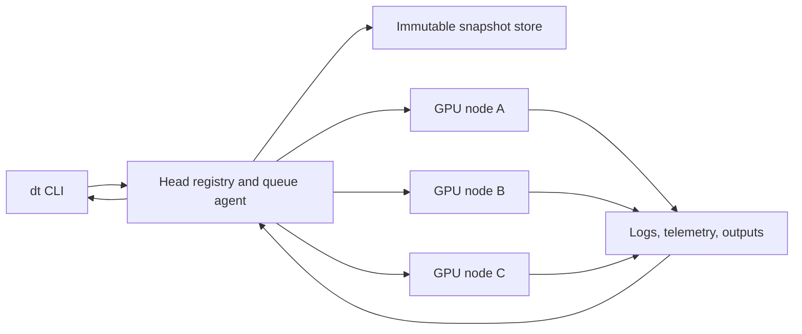

# DistTrainer

Run reproducible experiments on shared GPU servers without hand-managed SSH
sessions, GPU selection, environment setup, or result copies.

[](https://github.com/ChangWinde/dt/actions/workflows/ci.yml)
[](.github/SUPPORT.md)
[](CHANGELOG.md)
[](LICENSE)

DistTrainer, invoked as `dt`, is a command-line control plane for experiments
across SSH-accessible NVIDIA GPU servers. One submission captures the code
snapshot, selects collision-free capacity, recreates the locked environment,
queues the job, records telemetry, and preserves outputs for recovery.

```bash
dt run -n baseline -f -- python train.py --config configs/baseline.yaml
```

The Python distribution is named `disttrainer`. The installed command and
import package are both named `dt`.

## Why DistTrainer

| Problem | DistTrainer contract |
|---|---|
| Shared GPUs race between users and tools | Capacity probes and per-GPU leases prevent duplicate placement |
| Queued code changes before execution | Every job runs an immutable submit-time snapshot |
| Remote environments drift | `uv.lock`, Python version, extras, and setup inputs define reusable environments |
| SSH disconnects hide job state | Jobs continue in managed sessions; follow commands reconnect safely |
| Results scatter across machines | Logs, metadata, telemetry, and `outputs/` are recoverable by job ID |
| Performance claims lack controls | Fork, compare, batch, and chain preserve experiment lineage and inputs |

DistTrainer uses stable exit codes and machine-readable responses. Add `--json`
to automation-facing commands, and use `dt info JOB --json` when inspecting one
experiment.

## Quick start

### 1. Install

Install a reviewed release bundle:

```bash
bash bootstrap.sh \
  dist/disttrainer-0.6.2-py3-none-any.whl \
  dist/runtime-constraints.txt
dt --version
```

For development:

```bash
uv sync --locked --all-groups
uv run dt --help
```

DistTrainer supports Python 3.10 and 3.11. Head and compute hosts require Linux,
OpenSSH, rsync, tmux, flock, timeout, and an approved `uv` installation. GPU
nodes also require NVIDIA drivers and `nvidia-smi`.

### 2. Configure a head

Create a validated config in one command:

```bash
dt init --role head --center research \
  --node gpu-head --local-node gpu-head \
  --node gpu-node-1 \
  --project policy=~/projects/policy
```

For a single machine and the current project, the short form is enough:

```bash
dt init --role head --center research
```

It uses the current hostname as a local node and the current directory as the
default project. Preview the generated YAML with `--dry-run`; an existing
config is never replaced unless `--force` is explicit.

The resulting `~/.config/dt/config.yaml` is equivalent to:

```yaml
center: research
nodes:
  - {name: gpu-head, local: true}
  - {name: gpu-node-1}
projects:
  policy: ~/projects/policy
default_project: policy
paths:
  root: ~/dt
  worker_root: ~/dt
queue:
  poll_s: 60
  active_poll_s: 2
```

Then verify every host and runtime dependency:

```bash
dt doctor
dt agent install
dt agent status
```

Read the [configuration guide](docs/configuration.md) before adding setup hooks,
multiple centers, storage policy, or queue limits.

From a laptop, create a forwarding config with:

```bash
dt init --role laptop --center research --head gpu-head
```

### 3. Run and recover an experiment

```bash
dt free --who
dt run -n baseline -f -- python train.py
dt ps
dt info baseline
dt logs baseline -f
dt pull baseline --collection baseline
```

`-f` follows the submitted job and returns its process exit code. Without `-f`,
`dt run` prints the job ID and returns after registration. When no fitting GPU
is free, the job enters the resident FIFO queue by default. FIFO is preserved
among jobs that can use the same capacity; a job pinned to one busy node does
not hold later work pinned to a different node.

Write checkpoints, reports, and evaluation artifacts under
`$DT_JOB_DIR/outputs/`. This is the recovery boundary used by `dt pull`.

## Core workflows

### Keep a GPU fed

Submit independent commands as one same-snapshot queue:

```bash
dt batch gpu-node-1 \
  "python train.py --lr 1e-4" \
  "python train.py --lr 3e-4" \
  -n lr-sweep

dt ps --watch
```

Each item remains an independent job with its own state, logs, metrics, and
outputs. A failed batch item does not stop later items.

### Gate stages on success

```bash
dt chain gpu-node-1 \
  "python preflight.py" \
  "python train.py" \
  "python evaluate.py" \
  -n guarded-training
```

Each stage starts only after its predecessor exits successfully. Waiting stages
do not consume GPU leases and do not block unrelated runnable jobs.

### Compare a controlled variant

```bash
dt fork baseline -n candidate -- python train.py --variant candidate
dt wait baseline candidate
dt compare baseline candidate
```

Fork preserves the original source snapshot by default. Compare reports
differences in code, environment, placement, resources, and selected metrics.

### Diagnose a failure

```bash
dt ps --issues
dt info failed-run
dt logs failed-run -n 200
dt rerun failed-run
```

`rerun` preserves the command and resource request but captures current project
code, which makes fix-and-retry lineage explicit.

### Recover outputs and control storage

```bash
dt pull baseline --lite
dt storage
dt migrate layout --plan
dt compact --before 2026-07-01 --plan
dt clean --before 2026-07-01 --plan
```

Maintenance commands are previewable and fail closed on identity, path, or
snapshot inconsistencies. Cleanup retention is measured from terminal
completion, and failed node/result deletion retains the registry record for a
safe retry. From a laptop, cleanup defaults to one selected center; use
`--all-centers` only when that wider scope is intentional. Run mutation only
after reviewing its plan.

## How it works



The head registry is the lifecycle source of truth. The queue agent resolves
dependencies and capacity, then dispatches an immutable snapshot and attested
runtime payload. Compute nodes hold GPU leases and execute the job in a managed
session. Every terminal path records an exit marker or an explicit lost-state
reason.

Runtime data is role-scoped below the configured base:

```text
~/dt/
├── head/       registry, queue, immutable objects, managed pulls, cache
└── worker/     job capsules, environments, artifacts, cache, leases
```

Each worker job is one capsule containing `code/`, `outputs/`, `logs/`, and a
private `.dt/` control directory. Project worktrees and DT configuration stay
outside this runtime root. Existing flat-layout jobs remain readable; use
`dt migrate layout --plan` before moving any verified terminal data.

See [Architecture](docs/architecture.md) for module boundaries, data flow, and
the repository layout.

## Command map

| Goal | Commands |
|---|---|
| Find capacity | `dt free`, `dt doctor` |
| Submit work | `dt run`, `dt batch`, `dt chain` |
| Observe work | `dt ps`, `dt watch`, `dt info`, `dt logs`, `dt metrics` |
| Wait or recover | `dt wait`, `dt pull`, `dt attach` |
| Iterate | `dt rerun`, `dt fork`, `dt compare` |
| Operate the service | `dt agent`, `dt storage`, `dt migrate`, `dt compact`, `dt clean`, `dt kill` |
| Prepare remote data | `dt sync`, `dt seed` |

The [command reference](docs/command-reference.md) explains command selection,
stable exit codes, JSON behavior, and destructive-operation safeguards. Exact
options remain available through `dt COMMAND --help`.

## Documentation

Start with the [documentation index](docs/README.md).

| Audience | Guide |
|---|---|
| New operator | [Getting started](docs/getting-started.md) |
| Center administrator | [Configuration](docs/configuration.md) and [Operations](docs/operations.md) |
| Researcher | [Experiment workflows](docs/workflows.md) |
| Contributor | [Architecture](docs/architecture.md) and [Contributing](.github/CONTRIBUTING.md) |
| Release maintainer | [Release procedure](docs/releasing.md) |
| Security reviewer | [Security policy](.github/SECURITY.md) and [Support contract](.github/SUPPORT.md) |

Design decisions, validation audits, experiment records, and performance
reports remain in `docs/adr/`, `docs/audits/`, `docs/experiments/`, and
`docs/performance/`. Their generated indexes make the evidence searchable
without mixing it into the user path.

## Development

```bash
uv sync --locked --all-groups
uv run --no-sync pytest -q -p no:cacheprovider
uv run --no-sync ruff check .
uv run --no-sync ruff format --check .
uv run --no-sync python scripts/docs.py
```

Changes to queueing, process cleanup, transfer, identity, or destructive
maintenance require both success-path and denied/failure-path regression tests.
Read the [contribution guide](.github/CONTRIBUTING.md) before submitting a
change.

## Security and license

DistTrainer assumes one trusted Unix identity across trusted SSH hosts. It is
not a tenant-isolation boundary or a sandbox for untrusted project code. Read
[security policy](.github/SECURITY.md) before deployment.

This repository is currently distributed under the
[DistTrainer Proprietary License](LICENSE). No open-source usage rights are
granted by that license.
