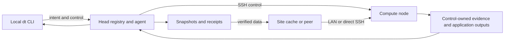

# dt

**dt — local work, remote compute.**

[](https://github.com/ChangWinde/dt/actions/workflows/ci.yml)
[](.github/SUPPORT.md)
[](CHANGELOG.md)
[](LICENSE)

`dt` is an AI-native remote execution tool for trusted, SSH-accessible Linux
machines. It runs a command from a configured local project on idle remote
compute, then exposes the job's state, logs, metrics, result, and declared
outputs through the same local CLI.

```bash
dt run -n baseline -f -- python train.py --config configs/baseline.yaml
```

The goal is a local-equivalent workflow without hand-managed SSH sessions, GPU
selection, environment setup, or result copies. The product, command, and
import package are named `dt`; the Python distribution remains `disttrainer`
for compatibility.

## Why dt

- **Reproducible execution:** every job uses an immutable submit-time source
  snapshot, identified environment, command, resource request, and runtime
  payload.
- **Safe scheduling:** capacity probes, advisory GPU leases, resource guards,
  and a fair runnable queue coordinate `dt`-managed placements and explain why
  a job is waiting.
- **AI-native control:** stable JSON, exit codes, structured states, bounded
  queries, persistent request receipts, and a redacted operation journal let
  an agent act without scraping terminal output.
- **Durable recovery:** remote jobs survive client disconnection; `info`,
  `logs`, `metrics`, `wait`, `pull`, `rerun`, and `exec` recover their state or
  continue work. Application stdout/stderr is rotated under a configured disk
  bound, while tails remain readable across retained generations.
- **Experiment workflows:** `batch`, `chain`, typed results, cross-node
  dependencies, `fork`, and `compare` preserve lineage across iterations.
- **Efficient transfer:** control and bulk-data SSH connections are isolated;
  verified site caches or direct same-site peers can avoid repeated transfer
  through slow ProxyJump or FRP routes.
- **Safe operation:** maintenance can persist an expiring, exact candidate
  plan for later application and revalidates every identity before deletion;
  installation and deployment are checksum-verified, atomic, and rollbackable.

AI-native describes the execution contract, not autonomous experiment design.
The project still owns its command, data, scientific logic, and outputs.

The latest published release is 0.9.0. Current `Unreleased` work targets
0.10.0 and is recorded in the [changelog](CHANGELOG.md). Promoting it still
requires a verified release bundle, a live upgrade/rollback canary, and
explicit release authority.

## Quick start

Install `dt` on one head machine. Workers receive the runtime payload with each
job and do not require a separate installation.

Requirements: Linux, Python 3.10 or 3.11, `uv`, OpenSSH, rsync, tmux, flock,
and timeout. GPU workers also require NVIDIA drivers, `nvidia-smi`, a working
user systemd manager with transient scopes, and `loginctl Linger=yes`; without
that proven lifecycle DT accepts only CPU jobs (`-g 0`) on the node. Check with
`loginctl show-user "$USER" -p Linger --value`; enabling linger may require an
administrator to run `loginctl enable-linger USER`.

### Install

From a clean, trusted checkout:

```bash
git clone https://github.com/ChangWinde/dt.git
cd dt
./install.sh --dry-run
./install.sh
export PATH="${UV_TOOL_BIN_DIR:-$HOME/.local/bin}:$PATH"
dt --version
```

The installer builds committed `HEAD`, installs locked dependencies with
mandatory hashes, and leaves an existing installation unchanged on failure.
Use the [release procedure](docs/releasing.md) for managed deployment.

### Configure

Create a head with one local node, one SSH worker, and one project:

```bash
dt init --role head --center research \
  --node gpu-head --local-node gpu-head \
  --node gpu-node-1 \
  --project policy=~/projects/policy

dt doctor
dt agent install
dt agent start
dt agent status
```

Use `dt init --dry-run` to preview configuration. Existing configuration is
not replaced without `--force`. See [Configuration](docs/configuration.md) for
multiple centers, laptops, site topology, environments, and storage policy.

### Run, observe, and recover

```bash
dt free --explain
job_id=$(dt run -n baseline -- python train.py | tail -1)
dt wait "$job_id"
dt info "$job_id"
dt logs "$job_id" --lines 200
dt pull "$job_id" --collection baseline
```

Without `-f`, `dt run` returns after durable registration. With `-f`, it
follows the job and returns the remote process exit code; Ctrl-C detaches
without cancelling the job. Write recoverable files below
`$DT_JOB_DIR/outputs/`.

For retry-safe submission from an agent:

```bash
dt run --request-id campaign-42-train -- python train.py
dt request campaign-42-train --json
```

For context-efficient polling:

```bash
dt ps --summary --json
dt ps --compact --active --limit 50 --json
dt ps --compact --issues --fields job_id,status,node,reason --limit 50 --json
```

## Command map

| Goal | Commands |
|---|---|
| Find capacity and routes | `dt free`, `dt doctor`, `dt topology` |
| Submit work | `dt run`, `dt batch`, `dt chain`, `dt request` |
| Observe work | `dt events`, `dt ps`, `dt info`, `dt diagnose`, `dt logs`, `dt metrics` |
| Wait or recover | `dt wait`, `dt pull`, `dt attach` |
| Iterate | `dt rerun`, `dt fork`, `dt exec`, `dt compare` |
| Operate the service | `dt agent`, `dt storage`, `dt migrate`, `dt compact`, `dt clean`, `dt kill` |
| Prepare remote data | `dt sync`, `dt seed` |

Use `dt COMMAND --help` for exact options and the
[command reference](docs/command-reference.md) for JSON and exit-code
contracts.

## How it works



The head registry is the lifecycle source of truth. Its agent resolves
dependencies and capacity, then dispatches an immutable snapshot and attested
runtime payload. Workers execute jobs in managed sessions and publish explicit
terminal state.

Site topology is configured, never inferred from hostnames. Direct-transfer
discovery verifies advertised endpoints and pinned SSH identity; it does not
scan subnets or perform UDP hole punching. Site caches and existing peers avoid
sending the same content digest across a site boundary separately for every
worker.

The local-equivalent contract covers observable execution: source, environment
identity, lifecycle, result, evidence, and declared outputs. Hardware and paths
may differ, and side effects outside declared outputs remain remote. A laptop
client forwards intent to its configured head; it does not implicitly upload a
laptop-only worktree.

DT keeps its authoritative operation journal, application job logs, telemetry,
and transfer evidence local and bounded. It does not require a central logging
service.
Operators that need fleet-wide search or alerts can feed the redacted
`dt events --json` contract to their collector; raw application logs are never
exported automatically.

## Scope and security

`dt` assumes one trusted Unix identity across trusted SSH hosts. It is not a
tenant-isolation boundary or a sandbox for untrusted code. Bare-process GPU
leases and `CUDA_VISIBLE_DEVICES` are advisory; they do not physically isolate
Vulkan, EGL, OpenGL, or device files. Read the
[security policy](.github/SECURITY.md) and
[support contract](.github/SUPPORT.md) before deployment.

## Documentation

| Topic | Guide |
|---|---|
| First deployment | [Getting started](docs/getting-started.md) |
| Configuration and topology | [Configuration](docs/configuration.md) |
| Experiments and recovery | [Workflows](docs/workflows.md) |
| Service and storage | [Operations](docs/operations.md) |
| Design and data flow | [Architecture](docs/architecture.md) |
| All documentation | [Documentation index](docs/README.md) |

## Development

```bash
uv sync --locked --all-groups
uv run --no-sync pytest -q -p no:cacheprovider \
  -W error::pytest.PytestUnhandledThreadExceptionWarning \
  --cov=dt --cov-branch --cov-report=term-missing:skip-covered
uv run --no-sync ruff check .
uv run --no-sync ruff format --check .
uv run --no-sync python scripts/docs.py
scripts/security-check.sh
```

See [Contributing](.github/CONTRIBUTING.md) for the complete quality gate.
Repository stewardship is defined by
[Governance](.github/GOVERNANCE.md), [CODEOWNERS](.github/CODEOWNERS), and the
[Code of conduct](.github/CODE_OF_CONDUCT.md).

## License

This repository is distributed under the
[DistTrainer Proprietary License](LICENSE). It currently grants no open-source
usage rights.
