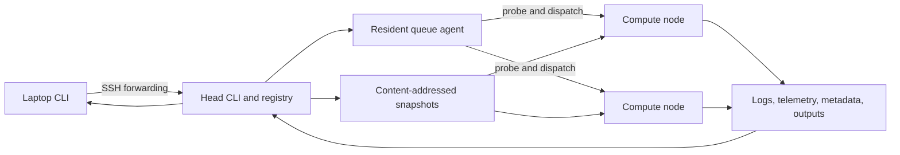

# DistTrainer architecture

DistTrainer separates operator intent, authoritative lifecycle state, remote
execution, and recoverable experiment data. The head is the control-plane
authority. Compute nodes execute only dispatched snapshots and runtime payloads.

## System view



A laptop never contacts compute nodes directly. It forwards immutable command
arguments to a configured head. The head validates the project and submission,
records the job, stages the exact source, and either dispatches immediately or
queues the job.

## Control plane

The head registry is the lifecycle source of truth. A registered job contains:

- stable job and center identity;
- source snapshot and runtime payload hashes;
- normalized command, project, resource request, pins, and guards;
- queue dependency and lineage;
- node, GPU, process-group, and lifecycle timestamps;
- terminal result or explicit failed/lost reason;
- artifact, environment, and recovery metadata.

The resident agent reconciles queued and running entries. It resolves
dependencies before probing GPU capacity. A pending dependency is a
job-specific blocker, so unrelated runnable work can pass it. A failed
dependency becomes failed before start and never consumes a GPU lease.

Capacity waits retain FIFO fairness among fitting jobs. Missing required paths
or incompatible pins do not block unrelated candidates.

## Data plane

Source snapshots are immutable and content-addressed. Editing a project after
submission cannot change queued work. Every dispatched job receives a private
code tree derived from the attested snapshot.

Large generated or reusable inputs are excluded from normal snapshots. The
operator can stage them explicitly and bind a content manifest. The compute
payload verifies that manifest before setup or application execution.

Each job owns:

```text
code/                 immutable dispatched source copy
cmd.sh                normalized application command
meta.json             dispatch contract
logs/                 setup and application logs
outputs/              recoverable application and DistTrainer evidence
exit_code              atomic terminal marker
finished_at            node-local completion timestamp
```

Managed pulls copy `outputs/` and the recovery record to the head results root.
Compaction can remove an old private `code/` copy only after validating its
content-addressed recovery snapshot.

## Remote execution

The head sends a small attested payload with every job:

| Payload | Responsibility |
|---|---|
| `launcher.sh` | Preflight, environment sync, artifact verification, GPU probe, and managed-session start |
| `wrapper.sh` | GPU leases, application process tree, signals, guards, telemetry, and terminal markers |
| `telemetry.py` | Fixed-cadence GPU, CPU, memory, I/O, thermal, and process-tree samples |
| `cuda_probe.py` | Driver-level allocation check before application start |
| `artifact_verify.py` | Bound-input size, identity, and path verification |
| `phase.sh` | Application-visible phase markers |

The wrapper owns advisory GPU lease file descriptors for its lifetime. A GPU
can therefore be reserved during CPU-only initialization even when
`nvidia-smi` shows no CUDA process.

Signal handling records a terminal code and reaps processes whose groups or
sessions escaped the main application group. Unverifiable process death remains
an explicit operational failure rather than a false terminal success.

## Public workflow policies

| Workflow | Policy |
|---|---|
| `run` | One independent current-snapshot job |
| `batch` | Independent same-node, same-snapshot items; runtime failures continue |
| `chain` | Same-snapshot linear dependency graph; predecessor failure stops successors |
| `rerun` | Historical command and resources with current project code |
| `fork` | Historical exact snapshot with explicit overrides |

The CLI composes these policies from shared submission contracts. Workflow
helpers do not implement secondary schedulers.

## Source modules

`src/dt/cli.py` is the Typer composition root. It preserves command names,
stdout/stderr separation, JSON schemas, and stable exit codes.

| Area | Modules |
|---|---|
| Configuration and state | `config.py`, `onboarding.py`, `jobs.py`, `submission.py` |
| Placement and queueing | `dispatch.py`, `agent.py`, `probe.py`, `completion.py` |
| Remote boundaries | `remote.py`, `forwarding.py`, `sshio.py`, `lifecycle.py` |
| Observation | `monitoring.py`, `doctor.py`, `render.py` |
| Data recovery and retention | `transfers.py`, `storage.py`, `compact.py`, `maintenance.py` |
| Identity | `snapshot_hash.py`, `snapshot_store.py`, `payload_hash.py` |
| Node runtime | `payload/` |

Domain modules expose typed or pure boundaries where practical. Subprocess,
SSH, filesystem, registry, and terminal rendering remain explicit seams so
failure paths can be tested independently.

Destructive retention policy lives outside the dispatcher. It accepts explicit
remote and local seams, validates each job directory against its exact registry
identity, and removes the registry record only after node and related local
cleanup succeed. Snapshot-store locking and persistence are likewise isolated
from submission orchestration.

## Repository layout

```text
dt/
├── .github/            Community policy, CI, and dependency automation
│   ├── CONTRIBUTING.md Contribution and verification contract
│   ├── SECURITY.md     Trust boundary and vulnerability reporting
│   └── SUPPORT.md      Supported platform and compatibility contract
├── docs/               User guides, architecture, decisions, and evidence
│   ├── adr/            Architecture decision records
│   ├── audits/         Validation and release evidence
│   ├── experiments/    Reproducible experiment records
│   ├── package-readme.md  Sanitized Python package description
│   ├── performance/    Performance measurements
│   ├── plans/          Historical implementation plans
│   └── project/        Completed project history
├── scripts/            Repository, release, and deployment tools
│   ├── deploy.sh       Explicit release deployment and rollback
│   └── repo_hygiene.py Enforced tracked-root allowlist
├── src/dt/             Installable Python package and node payload
├── tests/              Unit, integration, CLI, payload, and reliability tests
├── bootstrap.sh        Verified release installer
└── README.md           Repository product entry point
```

Generated experiment outputs, result collections, caches, virtual
environments, and release artifacts are ignored. They do not belong in source
snapshots or Git history. The tracked root allowlist and its rationale are
recorded in [ADR 0005](adr/0005-convention-first-repository-layout.md).

## Compatibility boundary

Public command names, JSON schemas, stable exit codes, job state semantics, and
the non-follow job-ID stdout contract are compatibility surfaces.

Internal module layout is not a public Python API. Compatibility commands may
remain registered but hidden from primary help when a simpler workflow
supersedes them. The rationale is recorded in
[ADR 0004](adr/0004-compatible-cli-convergence.md).
