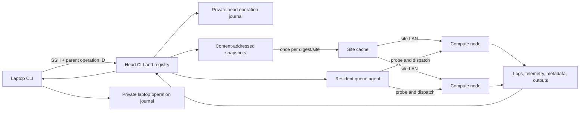

# dt architecture

`dt` is an AI-native SSH execution control plane for running a local project on
idle remote compute with a local-equivalent observable outcome. It separates
operator intent, authoritative lifecycle state, remote execution, and
recoverable experiment data. The head is the control-plane authority. Compute
nodes execute only dispatched snapshots and runtime payloads.

## Deployment roles

The normal center installs `dt` once on the head (also called the master by
operators). That installation owns configuration, projects, registry, queue,
scheduling, and recovery. Every configured SSH-reachable compute node is a
worker. A worker does not need the DT CLI or a second configuration; the head
ships the exact launcher, wrapper, telemetry code, and job contract at
dispatch time. A head may also be a worker when its node is configured as
`local: true`.

An optional laptop installation is only a forwarding client. It contacts the
head and never places work directly on workers.

## System view



A laptop never contacts compute nodes directly. It forwards immutable command
arguments to a configured head. The head validates the project and submission,
records the job, archives exact source and payload objects, and either
dispatches immediately or queues a small job-specific control bundle.

Local equivalence means the submitted snapshot, execution intent, environment
identity, lifecycle/result semantics, logs, and declared outputs are observable
and recoverable through the local CLI. It does not imply identical hardware,
paths, undeclared remote side effects, or a transparent shared filesystem.

## Control plane

Every CLI process also writes a bounded `dt_operation_event_v1` start/finish
trace. Laptop and head traces are linked by a generated parent operation ID.
The private journal records command categories, timing, build, exit status,
optional request/job correlation, and redacted problem fingerprints, never raw
arguments or exception messages. It is an operation index over the
authoritative request, registry, job, and agent evidence, not a tamper-proof
audit system. `dt events` exposes its bounded query contract; ADR 0016 defines
the security and retention boundary.

The head registry is the lifecycle source of truth. A separate durable request
store binds an optional caller request ID and normalized intent digest to one
allocated job ID before the compute launch boundary. Multi-job commands add a
secret-free parent intent whose ordered prefix points to deterministic child
requests; this makes partial submission resumable without weakening the
single-job launch boundary. A registered job contains:

- stable job and center identity;
- source snapshot and runtime payload hashes;
- normalized command, project, resource request, pins, and guards;
- queue dependency and lineage;
- node, GPU, process-group, and lifecycle timestamps;
- terminal result or explicit failed/lost reason;
- artifact, environment, and recovery metadata.

The resident agent reconciles queued and running entries. A restartable user
systemd service is preferred, with a visible cron compatibility fallback; its
heartbeat distinguishes an owned lock from a responsive scheduler. GPU runtime
is stricter than agent supervision: every GPU job requires a proved independent
user scope and `Linger=yes`, so logout cannot tear down its user manager. CPU
jobs retain a visibly weaker portable tmux path.

The agent resolves dependencies before probing GPU capacity. Dependencies can
require success, any terminal completion, or selected typed result states. A
false predicate becomes `skipped / dependency_skipped`. A pending dependency
is a cheap local wait, re-checked every tick, and unrelated runnable work can
pass it. A job-specific placement blocker (missing path, unfit or full node)
also lets later work pass, but its own retries re-probe nodes, so they run on
a capped exponential backoff instead of at full poll cadence. A failed or
false dependency never consumes a GPU lease.

Capacity waits retain FIFO fairness among jobs that can use the same capacity.
A busy pinned node preserves FIFO for later jobs on that node but does not
hold jobs pinned to different nodes behind it. Unpinned capacity waits still
stop the walk because they may compete for every eligible node. Missing
required paths or incompatible pins likewise do not block unrelated
candidates.

## Data plane

Source snapshots are immutable and content-addressed. Editing a project after
submission cannot change queued work. Every dispatched job receives a private
code tree derived from the attested snapshot.

Git commit and dirty-state probes are read-only, process-group bounded, and
time bounded. A small tracked diff is retained as convenience evidence, but
capture stops at 4 MiB; the complete snapshot hash and private code tree remain
the authoritative identity even when that optional patch is omitted.

Large generated or reusable inputs are excluded from normal snapshots. The
operator can stage them explicitly and bind a content manifest. The compute
payload verifies that manifest before setup or application execution.

Each job owns:

```text
code/                   writable working copy of the immutable source snapshot
logs/                   setup and application logs
outputs/                recoverable application outputs (application-owned)
.dt/meta.json           dispatch contract
.dt/command.sh          normalized application command
.dt/payload/            attested node runtime
.dt/state/              process, GPU, timestamp, and terminal markers
.dt/evidence/           DT-owned result, lifecycle, guard, phase, and telemetry
```

Managed pulls exclude `outputs/dt/`, copy application outputs with special
files disabled, then recover only a fixed, schema-validated allowlist from
`.dt/evidence/`. This prevents application-writable files from impersonating
DT lifecycle evidence. Compaction can remove an old private `code/` copy only
after validating its content-addressed recovery snapshot.

### Site-aware snapshot distribution

The control plane remains centralized on the head, but control traffic,
cross-site bytes, and site-LAN bytes are distinct routes. Configuration assigns
every topology-enabled node to an explicit site; DT never guesses network
domains from hostnames. `TopologyRegistry`, `ArtifactSourceResolver`, and
`TransferPlanner` decide where a digest comes from. `TransferExecutor` performs
the selected rsync route, while `ArtifactVerifier` owns full-tree identity and
atomic publication.

The first delivery of a digest to a `site-cache-first` site is:

```text
head authoritative snapshot -> site cache -> destination job directory
                         WAN       site LAN
```

Later destinations omit the WAN leg. A head-side `(site, digest)` lock prevents
concurrent duplicate uploads; a stable partial directory makes interrupted
uploads resumable. The cache is published only after its complete tree hash
matches the authoritative digest, and each destination is verified again. The
upload lock ends at publication; independent destination locks then allow
parallel LAN fan-out while preventing two writers from mutating one job tree.
Cache probe transport or permission failures remain unknown and fail closed;
they are never reclassified as a cache miss that could trigger more WAN load.

`topology-aware` replaces the fixed cache-to-worker edge with a bounded live
graph. `TopologyDiscovery` obtains interface advertisements and SSH host keys
through already-authenticated node control routes, finds at most the newest
same-digest job replica per configured seed node, and proves candidate direct
edges without ProxyJump. A local destination replica ranks first; healthy peer
replicas rank ahead of the site cache at equal configured cost. Only a true
cold miss uses the head-to-cache WAN leg. The selected peer tree and final
destination are both fully re-hashed, so registry provenance alone is never
treated as content proof.

Verified routes additionally rank by measured capacity (ADR 0024). Every bulk
transfer that moves enough data records `bytes/seconds` into a private,
bounded per-edge link-metrics store, and `dt topology --measure` feeds the
same store with bounded active streams. Ranking sorts by half-decade
throughput bucket before the static score, so a proven-fast direct edge beats
a proven-slow one without flapping between near-equals; an unmeasured edge
ranks optimistically so it gets tried, measured, and settled. The head's own
control route to each node is classified from evidence (a loopback dial or a
loopback peer observed by the node's sshd means an frp/autossh-style tunnel;
ProxyJump/ProxyCommand means a deliberate intermediary; the node seeing the
head's own address proves a direct path; anything else stays opaque).
Classification and measurements label `dt topology` and `dt doctor` and bias
efficiency only - they never veto the sole working route, and host-key
pinning, digest verification, and the route circuit stay authoritative.

Discovery never scans address ranges or trusts names as topology. Automatic
endpoints normally require a subnet advertised by both source and destination.
Minimal container/overlay nodes in one explicitly configured site may instead
offer their exact advertised RFC1918 `/32` address; DT probes that one endpoint
only. Interface discovery has a bounded `hostname -I` fallback when `ip -j` is
absent. DT pins the keys actually served by the destination SSH port, learned
inside its authenticated control route, in a private source-side known-hosts
file and keeps strict host-key checking on the direct edge. An unknown route
fails before a speculative WAN upload;
operators can still declare the separately observable one-attempt direct
fallback when availability outweighs WAN cost.

Direct P2P edges also have a private persistent circuit in head control state.
Probe failures and typed bulk-route failures update one atomically locked,
bounded file per configured directed edge. Success under bulk transfer closes
a transport circuit; an `ssh true` probe cannot erase evidence that an edge
failed only under load. Successive short-lived dispatchers therefore avoid a
known-bad route until its bounded exponential cooldown permits a half-open
probe. This state changes route availability only: SSH identity and complete
artifact digest verification remain mandatory.

SSH workload overlays separate `control`, `artifact`, and short-lived
`artifact-relay` multiplexers. OpenSSH receives the overlay through `-F`, so
its implicit ProxyJump process uses the same private pool instead of falling
back to a user's global bastion socket. Every pool disables agent forwarding.
Gateway and peer data sources authenticate with credentials already available
on that trusted source; DT neither lends the head's agent socket nor copies a
private key. Host-key verification remains enabled and missing credentials or
trust fail closed.

Every completed site delivery writes a private `dt_artifact_transfer_v1` event
under head control state (`transfers/events.jsonl`) and emits a concise human log
with digest, source/destination sites and nodes, selected legs, cache hit,
cross-site bytes, site bytes, file count, lock wait, and duration. Generic
rsync retry events add a stable failure kind and do not retry authentication,
host-key, permission, or disk-space failures. Only transport evidence such as
timeouts, resets, unreachable routes, and broken pipes updates the edge
circuit; artifact data, capacity, permission, and identity failures do not
misclassify a healthy route.

## Remote execution

The head sends a small attested payload with every job:

| Payload | Responsibility |
|---|---|
| `launcher.sh` | Preflight, environment sync, artifact verification, GPU probe, and managed-session start |
| `wrapper.sh` | GPU leases, application process tree, signals, guards, telemetry, and terminal markers |
| `telemetry.py` | Fixed-cadence GPU, CPU, memory, I/O, thermal, and process-tree samples |
| `cuda_probe.py` | Driver-level allocation check before application start |
| `artifact_verify.py` | Bound-input size, identity, and path verification |
| `phase.sh` | Application-visible phase markers |
| `result.py` | Bounded, atomic application result emission and validation |

The wrapper owns advisory GPU lease file descriptors for its lifetime. A GPU
can therefore be reserved during CPU-only initialization even when
`nvidia-smi` shows no CUDA process.

The bare-process lease is not physical device isolation. `CUDA_VISIBLE_DEVICES`
controls CUDA enumeration, while Vulkan, EGL, OpenGL, and direct NVIDIA/DRM
device-node access remain outside that environment-variable boundary. DT does
not currently claim strong isolation for graphics workloads. ADR 0014 records
the proposed OCI/CDI enforcement backend and the rejected environment-only
alternative.

## Agent job query boundary

The complete `ps --json` array remains a compatibility and offline-inventory
surface. Bounded polling uses `dt_ps_query_v1`: each head filters, summarizes,
projects, and keyset-pages its own registry before laptop transfer. The laptop
merges one bounded page per center, scopes references, applies the global page,
and preserves partial-center errors. Registry file modification time supplies
`updated_at` for legacy rows; subsequent atomic saves persist it directly.

Cursors bind their created/updated keyset anchor to the query filters. They are
validated opaque state, not credentials. Pagination is deterministic in a live
view but does not promise snapshot isolation across lifecycle changes.

Signal handling records a terminal code and reaps processes whose groups or
sessions escaped the main application group. Unverifiable process death remains
an explicit operational failure rather than a false terminal success.

## Public workflow policies

| Workflow | Policy |
|---|---|
| `run` | One independent current-snapshot job |
| `batch` | Independent same-node, same-snapshot items; runtime failures continue |
| `chain` | Same-snapshot linear dependency graph; predecessor failure stops successors |
| `run --after-complete/--after-result` | Cross-node terminal or typed-result dependency |
| `rerun` | Historical command and resources with current project code |
| `fork` | Historical exact snapshot with explicit overrides |
| `exec` | Historical exact snapshot and existing same-node environment, without sync |

The CLI composes these policies from shared submission contracts. Workflow
helpers do not implement secondary schedulers.

## CLI presentation boundary

The installed console script enters through a minimal audited bootstrap. Exact
`dt --version` probes render shared build identity without importing the full
Typer command graph, while still writing the same private operation start and
finish events. All other invocations load the application lazily and preserve
the existing CLI contract. ADR 0019 records why this bounded Python split was
chosen before a wholesale CLI decomposition or native launcher.

Human output is an operator interface, while JSON, exit codes, and stdout/stderr
separation are automation interfaces. Default human views show current state,
anomalies, progress, and the next useful action. Complete provenance and
diagnostic internals are explicit through command-specific detail flags; JSON
retains the complete documented payload.

Shared Rich behavior and reusable fleet/job tables live in `render.py`. The CLI
composition root supplies already validated domain data and chooses default,
detail, or machine presentation. A command-specific card may remain private to
`cli.py` when it only composes that command's payload; reusable rendering policy
does not move back into the composition root. Display compaction never alters
executable paths or arguments. Empty results use concise state messages rather
than empty tables. The full rationale and width contract are recorded in
[ADR 0008](adr/0008-operator-first-cli-presentation.md).

## Source modules

`src/dt/cli.py` is the Typer composition root. It preserves command names,
stdout/stderr separation, JSON schemas, and stable exit codes.

| Area | Modules |
|---|---|
| Configuration and state | `config.py`, `layout.py`, `path_contract.py`, `onboarding.py`, `jobs.py`, `submission.py`, `submission_intent.py`, `submission_group.py`, `operation_log.py` |
| Placement and queueing | `dispatch.py`, `agent.py`, `scheduler.py`, `probe.py`, `completion.py` |
| Remote boundaries | `remote.py`, `forwarding.py`, `sshio.py`, `topology.py`, `artifact_distribution.py`, `lifecycle.py` |
| Observation | `monitoring.py`, `ps_query.py`, `doctor.py`, `render.py` |
| Data recovery and retention | `transfers.py`, `storage.py`, `migration.py`, `compact.py`, `maintenance.py` |
| Identity | `snapshot_hash.py`, `snapshot_store.py`, `payload_hash.py` |
| Node runtime | `payload/` |

Domain modules expose typed or pure boundaries where practical. Subprocess,
SSH, filesystem, registry, and terminal rendering remain explicit seams so
failure paths can be tested independently.

Destructive retention policy lives outside the dispatcher. It accepts explicit
remote and local seams, validates each job directory against its exact registry
identity, and removes the registry record only after node and related local
cleanup succeed. Snapshot-store locking and persistence are likewise isolated
from submission orchestration.

GPU capacity probing overlaps inventory, compute-process inventory, and system
statistics inside one bounded remote command. Output is reassembled in a stable
protocol order, and any missing driver evidence fails closed before placement.
Each node owns its finite telemetry deadline while SSH keeps a separate transport
grace period. The concurrency boundary and the rejected resident-service
alternative are recorded in
[ADR 0009](adr/0009-bounded-parallel-gpu-probes.md).

## Repository layout

```text
dt/
├── .github/            Community policy, CI, and dependency automation
│   ├── CONTRIBUTING.md Contribution and verification contract
│   ├── SECURITY.md     Trust boundary and vulnerability reporting
│   └── SUPPORT.md      Supported platform and compatibility contract
├── docs/               User guides, architecture, decisions, and evidence
│   ├── adr/            Architecture decision records
│   ├── audits/         Validation and release evidence
│   ├── experiments/    Reproducible experiment records
│   ├── package-readme.md  Sanitized Python package description
│   ├── performance/    Performance measurements
│   ├── plans/          Historical implementation plans
│   └── project/        Completed project history
├── scripts/            Repository, release, and deployment tools
│   ├── deploy.sh       Explicit release deployment and rollback
│   └── repo_hygiene.py Enforced tracked-root allowlist
├── src/dt/             Installable Python package and node payload
├── tests/              Unit, integration, CLI, payload, and reliability tests
├── bootstrap.sh        Verified release installer
├── install.sh          Immutable clean-checkout source installer
└── README.md           Repository product entry point
```

Generated experiment outputs, result collections, caches, virtual
environments, and release artifacts are ignored. They do not belong in source
snapshots or Git history. The tracked root allowlist and its rationale are
recorded in [ADR 0005](adr/0005-convention-first-repository-layout.md).

## Compatibility boundary

Public command names, JSON schemas, stable exit codes, job state semantics, and
the non-follow job-ID stdout contract are compatibility surfaces.

Internal module layout is not a public Python API. Compatibility commands may
remain registered but hidden from primary help when a simpler workflow
supersedes them. The rationale is recorded in
[ADR 0004](adr/0004-compatible-cli-convergence.md).
